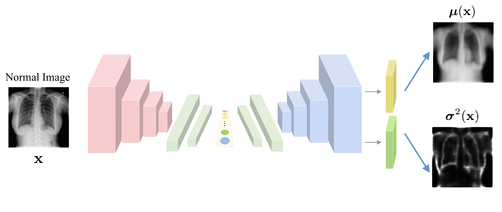

# UAE
Implementation of "Abnormality Detection in Chest X-ray Images Using Uncertainty Prediction Autoencoders" in MICCAI 2020. 
 \[[paper](https://link.springer.com/chapter/10.1007/978-3-030-59725-2_51)\]



## Datasets
RSNA Pneumonia Detection Challenge Dataset: https://www.kaggle.com/c/rsna-pneumonia-detection-challenge/data

Pediatric Dataset: https://data.mendeley.com/datasets/rscbjbr9sj/3
## Requirements

## Basic usage
To train a traditional autoencoder:
```python
python uae_main.py
```
To train an autoencoder with uncertainty:
```python
python uae_main.py --u
```
To evaluate a model:
```python
python uae_main.py --eval --u(optional)
```
## Cite
```latex
@inproceedings{mao2020abnormality,
  title={Abnormality Detection in Chest X-Ray Images Using Uncertainty Prediction Autoencoders},
  author={Mao, Yifan and Xue, Fei-Fei and Wang, Ruixuan and Zhang, Jianguo and Zheng, Wei-Shi and Liu, Hongmei},
  booktitle={International Conference on Medical Image Computing and Computer-Assisted Intervention},
  pages={529--538},
  year={2020},
  organization={Springer}
}
```
